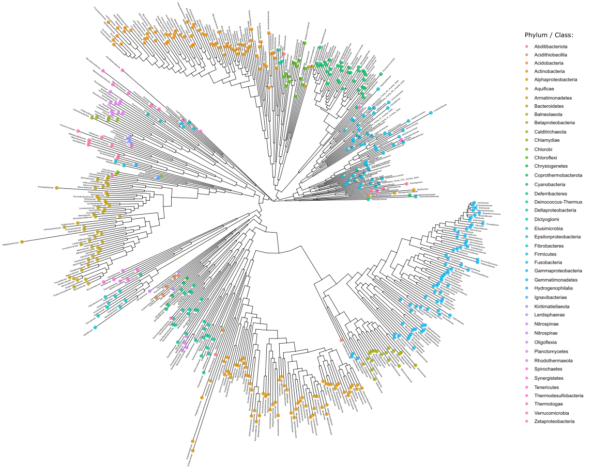

# Bacteria_Tree_of_life
<h3>Ribosomal proteins-based Phylogenetic tree to represent all known bacteria</h3>

As part of my studies toward an MSc in Computational Biology at Tel-Aviv university, I had the need for an all-known bacteria phylogenetic tree.
This tree, later, served me as a visualization skeleton, upon it and with respect to it, all of my bacteria-specific study results and insights were mounted and shown.

Knowing that the tree is supposed to represent all known bacteria, the 'family' phylogenetic rank was chosen, for it is detailed and high res enough but, still manageable and informative. In contrast, for that purpose - ranks as genus and species, even though achievable, are too specific to the point of being un-informative.

Given principles showed in previous work (Hug et al. 2016), 15 bacterial ribosomal proteins (L2, L3, L4, L5, L6, L14, L16, L18, L22, L24, S3, S8, S10, S17, and S19) were chosen for the task. Proteins were obtained with the use of Kyoto Encyclopedia of Genes and Genomes (KEGG) (Kanehisa and Goto 2000; Kanehisa 2019). All the ones belonging to the corresponding KEGG's KOs were downloaded, then clustered by MMseq2 (Mirdita et al. n.d.), filtered (clusters with less than five members), aligned by MAFFT, and HMM build by HMMER3 (Eddy 2011). At last, 28,667 proteins were used to construct 88 HMM profiles, representatives of the 15 aforementioned bacterial ribosomal proteins. 

All 88 profiles were searched using hmmsearch by HMMER3, against the non-redundant NCBI’s RefSeq database, which was filtered from candidate taxonomies. The hmmsearch was fixed with 1∙10^(-12) as the Evalue threshold, and only genomes that accumulated hits associated with all 15 ribosomal proteins continued for the following. Each bacterial family was represented by a genome of its kind (In case of redundancy, genomes were chosen randomly). To conclude, 509 genomes of bacterial families' representatives, which comprise highly related ribosomal proteins, were chosen to work with. 

Each genome representative of the aforementioned 15 hits, was parsed into single sequences FASTA files, then using MAFFT, MSA was constructed upon every ribosomal protein. Sorted in the same order, the 15 distinctive alignment FASTA files of all genomes were concatenated, to create a united MSA, 5,835 Amino Acid (AA) long. At last, the concatenated MSA underwent tree construction by the FastTree program (Price, Dehal, and Arkin 2009) with default parameters.

Finally, the tree was visualized via ggtree (Yu 2020) and ggtreeExtra (Xu et al. 2021), R programming language packages.

<strong>Disclaimers:</strong>

Rather than, a given product, the purpose of the scripts given is to demonstrate the project. Therefore, and to keep things focused, even though the code for all of the above is heavily environment-dependent, many supporting features which are crucial for a complete run, still are excluded. In addition, some files, e.g., HMM files, hmmsearch files, and of course the huge FASTA files are excluded due to memory reasons.
Having said that, I would love to assist anyone interested, please feel free to reach out if you wish.
